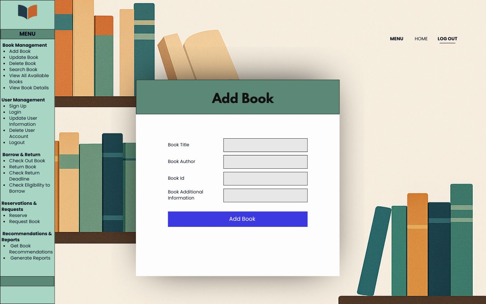

# 📚 Library Management System

A console-based library automation system developed in Java that enables the management of books and users through fundamental operations.

This project is designed as a simple yet functional application that includes features such as user registration, book addition/update, borrowing, returning, and making reservations.

🛠️ Development Environment: Java (JDK 17+), Console Application  
📸 A sample interface illustration is provided below.

---

